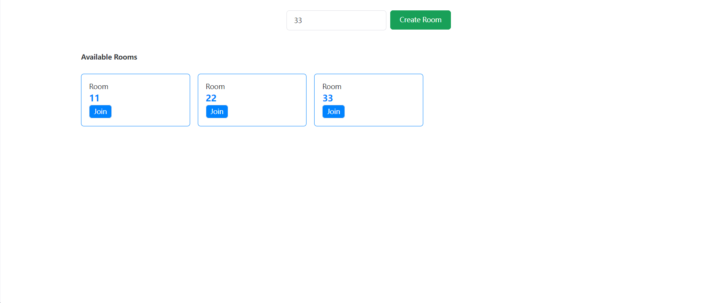
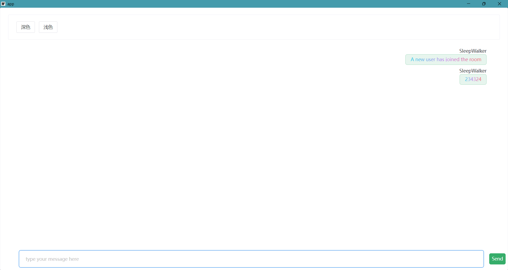
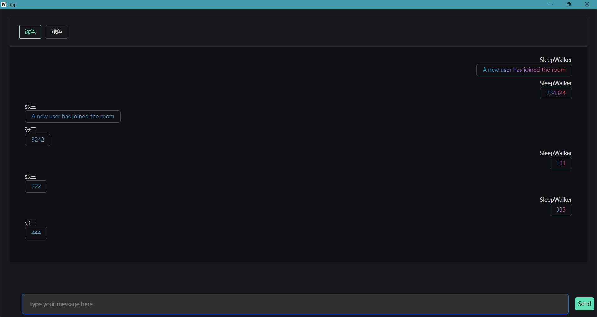

# 项目介绍

## 目录结构

- server是服务端，goframe
- app是前端，wails

---

## 项目特点

- **并发监控客服状态：** 开启一个goroutine监听客服的上线和下线事件，使用Channel来传递事件，实时地捕获客服的状态变化，如并广播发送在线客服信息。

- **使用WebSocket通信**。

- **创建和加入房间进行聊天**。

## 技术介绍

- 后端：GoFrame、WebSocket

- 前端：Wails、Vue3、TypeScript

## 项目展示

Thanks For

- [GitHub - dhij/go-next-ts_chat: Realtime chat built with Go, Next & Typescript](https://github.com/dhij/go-next-ts_chat)